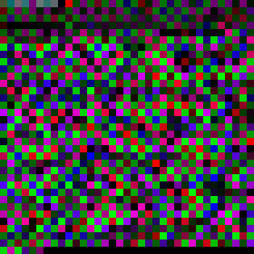
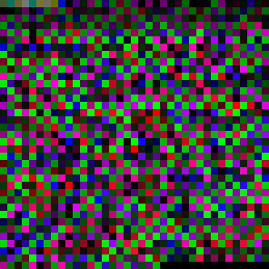
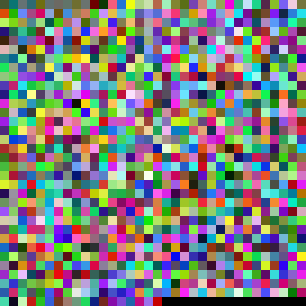
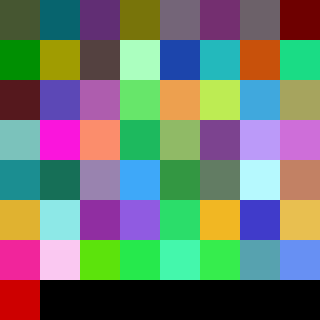

# ISTS — Image-Serialized Transport & Storage Protocol

> A dependency-free, from-scratch protocol that takes **any file** — text,
> JSON, DNA, an entire video — runs the best lossless compressor for that
> specific data, and paints the compressed bytes into a single **PNG image**
> you can save, share, embed, or upload anywhere an image is allowed. Reload
> the PNG and you get **every byte back, bit-for-bit**.

**Live demo (GitHub Pages, testing version — `v0.9.0-beta`):**
👉 **https://upendraakki.github.io/ists-protocol/**

**Video walkthrough:**
[](https://youtu.be/qFh1FceuZAc)

---

## What "ISTS" stands for

| Letter | Meaning | What it maps to in this repo |
|:------:|---------|------------------------------|
| **I** | **Image-Serialized** | Any file's bytes → RGB pixels → one lossless PNG (`filecodec.js`) |
| **S** | **Smart / Selective compression** | Try `raw`, `lzw`, `o1`, `lzw+o1` — keep whichever wins (`pack.js`) |
| **T** | **Transport** | The PNG is a universal envelope — chat, cloud drive, ``, QR |
| **S** | **Storage** | The image *is* the file. Losslessly. Reload it and you're back. |

The full sentence: *"a protocol for **I**mage-**S**erialized **T**ransport &
**S**torage of arbitrary data, with best-fit lossless compression baked in."*

---

## The idea, in one picture

```
┌─────────────┐   ┌──────────────────┐   ┌────────────┐   ┌─────────────┐
│  ANY FILE   │──▶│  SMART PACKER    │──▶│  PIXEL     │──▶│  ONE PNG    │
│ text .json  │   │  raw / lzw /     │   │  ENCODER   │   │  (portable) │
│ .mp4 .zip … │   │  o1 / lzw+o1     │   │  3 B/pixel │   │             │
└─────────────┘   └──────────────────┘   └────────────┘   └──────┬──────┘
                                                                 │ share / store
                                                                 ▼
┌─────────────┐   ┌──────────────────┐   ┌────────────┐   ┌─────────────┐
│  ORIGINAL   │◀──│  DECODE HEADER   │◀──│  PIXEL     │◀──│   LOAD PNG  │
│  BYTES      │   │  + UNPACK        │   │  DECODER   │   │             │
│  (identical)│   │  by method tag   │   │            │   │             │
└─────────────┘   └──────────────────┘   └────────────┘   └─────────────┘
```

Every step is **lossless** and **verified** by fuzz tests. The PNG is not a
lossy re-encoding — it's a container that happens to be a valid image.

---

## Real sample conversions (auto-generated, round-trip verified)

Every image below was produced by `node scripts/generate-samples.js` on this
repo. Each was decoded back and byte-compared against the original — all pass.

| Input | Original | Packed | Method | Savings | PNG size |
|-------|--------:|-------:|--------|--------:|---------:|
| **Lorem ipsum** ×60 | 11,280 B | 3,560 B | `lzw`    | **68%** | 35 × 35 |
| **A Tale of Two Cities** opening ×80 | 18,400 B | 4,034 B | `lzw`    | **78%** | 37 × 37 |
| **`users.json`** (120 records) | 12,018 B | 3,384 B | `o1`     | **72%** | 34 × 34 |
| **DNA sequence** (20k of ACGT) | 20,000 B | 143 B | `o1`     | **99%** | 8 × 8 |

### Size comparison (gray = original, blue = packed)


### The actual PNGs (upscaled 8×–40× for visibility)

| Lorem ipsum | Tale of Two Cities | users.json | DNA (ACGT×20 000) |
|:---:|:---:|:---:|:---:|
|  |  |  |  |
| 35 × 35 | 37 × 37 | 34 × 34 | 8 × 8 |

That tiny 8 × 8 image on the right holds **twenty thousand DNA bases**. The
order-1 arithmetic coder recognised the 4-symbol alphabet and squeezed it to
0.7% of the original — the PNG is only 314 bytes on disk.

Raw (`.png`) and upscaled (`.display.png`) versions live in
[`docs/samples/`](docs/samples/); regenerate them any time with
`node scripts/generate-samples.js`.

---

## The three web pages

| Page | What it shows | Live URL |
|------|--------------|----------|
| `index.html`   | **Text compressor** — the base-N idea, 6-step visual explainer | [/](https://upendraakki.github.io/ists-protocol/) |
| `compress.html`| **Compress → Image** — any file becomes a portable PNG | [/compress.html](https://upendraakki.github.io/ists-protocol/compress.html) |
| `video.html`   | **Video ⇄ Image vault** — a full video (audio included) stored as one lossless PNG | [/video.html](https://upendraakki.github.io/ists-protocol/video.html) |

---

## The engines under the hood

```
                      ┌──────────────────────────────────────┐
                      │             pack.js                  │
                      │  "smart packer": tries all methods,  │
                      │   writes a 1-byte tag + winner       │
                      └──┬────────────┬────────────┬─────────┘
                         │            │            │
              ┌──────────▼──┐  ┌──────▼──────┐  ┌──▼───────────┐
              │  codec.js   │  │   lzw.js    │  │   range.js   │
              │  base-N     │  │   LZW dict  │  │  order-1     │
              │  positional │  │   O(n) time │  │  arithmetic  │
              │  BigInt     │  │             │  │  (Subbotin)  │
              └─────────────┘  └─────────────┘  └──────────────┘
                                        │              │
                                        └──────┬───────┘
                                               ▼
                                      ┌────────────────┐
                                      │ filecodec.js   │
                                      │  bytes ⇄ PNG   │
                                      │  3 bytes/pixel │
                                      └────────────────┘
```

| File | Method | Best at |
|------|--------|---------|
| [`codec.js`](codec.js)  | **base-N positional** — every character → a digit, all digits fold into one big `BigInt` | teaching; small-alphabet text |
| [`lzw.js`](lzw.js)      | **LZW dictionary** — learns repeated sequences on the fly | long / repetitive text (linear time) |
| [`range.js`](range.js)  | **order-1 arithmetic** — adaptive Subbotin range coder + Fenwick model | natural language, restricted alphabets |
| [`pack.js`](pack.js)    | **smart packer** — runs `raw`, `lzw`, `o1`, `lzw+o1` and keeps the smallest | anything (never larger than input + 2) |
| [`filecodec.js`](filecodec.js) | **file ⇄ pixels** — packs bytes 3-per-pixel into a lossless RGBA PNG | serializing any bytes as an image |

### The one-byte method tag

Every packed blob starts with a single tag byte so the decoder knows which
method wrote it:

```
  0x00  raw          — store the bytes unchanged (random / tiny data)
  0x01  lzw          — dictionary compression   (repetitive data)
  0x02  o1           — order-1 arithmetic       (natural language)
  0x03  lzw + o1     — dictionary, then entropy-coded (very repetitive text)
```

The packer runs all four, measures each output, and picks the smallest. There
is no guessing — the shortest path wins for **this specific input**.

---

## The wire format (what's inside the PNG)

```
┌────────────────────────────────────────────────────────────────────┐
│  RGBA pixels of a lossless PNG (alpha pinned at 255 — no premult)  │
│                                                                    │
│   R    G    B    │ R    G    B    │ R    G    B    │  ...          │
│  byte byte byte  │byte byte byte  │byte byte byte  │               │
│                                                                    │
│  ┌───────────────────────────────────────────────────────────────┐ │
│  │  "FV1"  (3 bytes)  — magic                                    │ │
│  │  varint nameLen ; name  (utf-8)                               │ │
│  │  varint mimeLen ; mime  (utf-8)                               │ │
│  │  dataLen  (4 bytes, big-endian)                               │ │
│  │  ─── PACKED PAYLOAD ───                                       │ │
│  │  [method tag byte]                                            │ │
│  │  [method-specific bytes (raw | lzw | o1 | lzw+o1) …]          │ │
│  │  zero-padding to the next pixel boundary                      │ │
│  └───────────────────────────────────────────────────────────────┘ │
└────────────────────────────────────────────────────────────────────┘
```

Three bytes per pixel → an *N*-byte payload needs `ceil(N / 3)` pixels →
square dimensions `⌈√pixels⌉`.

---

## Run it locally

```bash
python -m http.server 8000     # any static server; then open http://localhost:8000/
```

Or with Node:

```bash
npx http-server -p 8000
```

Then open:

- <http://localhost:8000/> — text compressor
- <http://localhost:8000/compress.html> — file → PNG
- <http://localhost:8000/video.html> — video ⇄ PNG

---

## Regenerate the README's sample images

```bash
node scripts/generate-samples.js
```

Writes fresh PNGs + `stats.json` into `docs/samples/`. Every image is
round-trip verified against its source before the script exits.

---

## Verification

Everything is fuzz-tested — thousands of random inputs, all provably lossless.

```bash
node test.js           # base-N: text + image round trips
node lzw.test.js       # LZW: 4 500 fuzz cases + ratios
node pack.test.js      # smart packer: 4 000 fuzz cases + method selection
node filecodec.test.js # file <-> image round trips
```

The GitHub Pages workflow (`.github/workflows/pages.yml`) runs all of the
above on every push before publishing — a broken build never reaches the site.

---

## What ISTS is — and isn't (read this)

Compression trades on **redundancy**. The limit is real, not a marketing
number to be worked around:

- **No lossless method shrinks every input.** Distinct messages need distinct
  outputs, and there aren't enough shorter ones to go around — the *pigeonhole
  principle*. Random / already-compressed data (`.mp4`, `.jpg`, `.zip`) does
  **not** shrink. Our packer notices and stores it `raw` (input + 1 byte).
- **You can't re-pack to keep shrinking.** Once redundancy is gone, a second
  pass only adds overhead.
- **Video-as-image isn't smaller** than the video. An `.mp4` is already
  compressed; the ISTS PNG is a lossless *container*, not a lossy codec.
- **QR codes hold ~2.9 KB max**, so they only fit small compressed payloads —
  a transport for tiny data, not a compression method.

Where ISTS *does* shine: any redundant, text-shaped, or narrow-alphabet input.
The DNA sample above is the extreme case; JSON, English prose, logs, and code
routinely see 60–90% savings.

---

## Project status

| | |
|---|---|
| **Version** | `v0.9.0-beta` (testing version — API may still move before `1.0`) |
| **Dependencies** | zero (runtime); one-file Node stdlib (`zlib`) for the sample generator |
| **Browsers** | any evergreen browser with `<canvas>` and `BigInt` |
| **Node** | ≥ 12 |
| **License** | [MIT](LICENSE) |

---

## Repository layout

```
ists-protocol/
├── index.html            ← page 1: text compressor
├── compress.html         ← page 2: any file → PNG
├── video.html            ← page 3: video ⇄ PNG vault
├── codec.js              ← base-N positional
├── lzw.js                ← LZW dictionary
├── range.js              ← order-1 arithmetic (Subbotin)
├── pack.js               ← smart multi-method packer
├── filecodec.js          ← file ⇄ image (FV1 format)
├── *.test.js             ← fuzz-tested round trips
├── scripts/
│   └── generate-samples.js   ← makes docs/samples/*.png
├── docs/samples/         ← README's real sample PNGs
├── .github/workflows/
│   └── pages.yml         ← auto-deploy to GitHub Pages
└── README.md             ← you are here
```

---

## License

MIT — see [LICENSE](LICENSE). Use it, fork it, learn from it, ship it.
